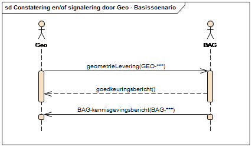

# Hoofdstuk 1 Inleiding 
Dit hoofdstuk geeft een inleiding op het StUF-Geo BAG berichtenverkeer. 

## 1.1 Waarom dit koppelvlak? 
Voor het automatisch uitwisselen van gegevens tussen twee afdelingen binnen de organisatie zijn afspraken nodig welke worden vastgelegd in een koppelvlak-specificatie. Een koppelvlak is een interface die volgens een bepaalde standaard de uitwisseling van gegevens tussen informatiesystemen verzorgt. Een koppelvlak werkt met standaarden. Het aanleverende systeem is verantwoordelijk voor de vertaling van gegevens naar die standaard en het afnemende systeem zorgt voor omzetting naar haar eigen ‘taal’. 

Dit koppelvlak beschrijft de gegevensuitwisseling tussen het registratiesysteem BAG en het registratiesysteem Geo binnen een gemeente. In het registratiesysteem BAG worden gebouw- en adresgegevens bijgehouden in het kader van de wet Basisregistraties Adressen en Gebouwen (BAG). In het registratiesysteem Geo worden de geometrie en attribuutgegevens van topografische objecten bijgehouden in het kader van de Basisregistratie Grootschalige Topografie (BGT) en ten behoeve van intern gebruik (o.a. beheer openbare ruimte). Voor het registratiesysteem Geo wordt ook geometrie van objecten in het registratiesysteem BAG ingewonnen en bijgehouden. 

Om er voor te zorgen dat de registratiesystemen BAG en Geo, en de basisregistraties BAG en BGT onderling consistent zijn, is een koppeling op basis van een standaard van groot belang. Het werkingsgebied van dit koppelvlak is dan ook primair bedoeld voor optimalisatie van gegevensuitwisseling en het beheer van twee wettelijke backoffice processen voor BAG en BGT. Als aanvulling hierop zijn voor aansluiting bij de bredere gemeentelijke behoefte optionele objecttypen uit RSGB toegevoegd, zodat de inwinning van de geometrie van deze objecttypen meegenomen kunnen worden in de bijhouding van de BAG en BGT objecttypen. 

De voordelen van deze koppelvlakstandaard zijn o.a. dat 
* in een specifiek applicatielandschap verschillende BAG-applicaties met verschillende BGT-applicaties kunnen koppelen (via een gegevensdistributiecomponent). 
* een geautomatiseerde koppeling voorkomt, ook op de plaats waar het maar door één persoon wordt uitgevoerd, overtikwerk en fouten in de administratie. 
* het de onderlinge consistentie en de kwaliteit van de gegevens in de twee administraties vergroot wat tot betere informatievoorziening bij besluiten en fraudedetectie leidt. 
* het zorgt voor een helder inzicht in de werkvoorraad aan beide zijden en de stroomlijning van de processen: zaken kunnen niet meer onzichtbaar lang blijven liggen; geometrie wordt niet vaker dan noodzakelijk ingemeten. 

## 1.2 Leeswijzer 
Dit document beschrijft het berichtenverkeer tussen het registratiesysteem BAG en het registratiesysteem Geo (hierna respectievelijk BAG en Geo). Deze koppelvlakspecificatie beschrijft de uitwisseling van geometrie voor BAG-objecten, waarbij BAG de partij is die een verzoek doet om geometrie en Geo de partij is die geometrie levert. BAG houdt Geo verder op de hoogte van wijzigingen (o.a. status en attribuutgegevens) op de BAG-objecten via notificaties (BAG-kennisgevingen) (zie Figuur 1). 

*Figuur 1.1 Schematische weergave componenten StUF-Geo BAG berichtenverkeer.* 

De standaard van berichten waarmee de gegevens tussen BAG en Geo worden uitgewisseld is gebaseerd op het Standaard Uitwiselings Formaat (StUF). Naast bestaande berichten uit StUF 03.10 en de BAG-berichtencatalogus (als onderdeel van StUF-BG) worden voor dit koppelvlak specifieke berichten toepast, aangeduid met StUF-Geo BAG berichten. Dit koppelvlak is als apart sectormodel (geoBAG) gepositioneerd binnen de BAG berichtencatalogus. 

De structuur van dit document is als volgt: o.b.v. een aantal uitgangspunten o.a. verantwoordelijkheden en taken in Hoofdstuk 2 worden een drietal algemene scenario’s van de werkprocessen tussen BAG en Geo geschetst in Hoofdstuk 3. In deze scenario’s worden bepaalde berichten zoals verzoeken en leveringen verstuurd. De inhoud van de berichten zijn nader gedefinieerd in Hoofdstuk 4 en Hoofdstuk 5. 

## 1.3 Verbinding met de GEMMA Informatiearchitectuur 
De GEMMA Informatiearchitectuur[^1] geeft inrichting aan de informatiehuishouding van gemeenten. De informatiehuishouding betreft de referentiecomponenten en applicatiefunctionaliteit waarmee de gegevens kunnen worden opgeslagen, geraadpleegd en processen kunnen worden ondersteund etc. Ook de informatiemodellen (RSGB, RGBZ, ImZTC, etc.) en berichtenstandaarden (StUF, StUF-BG, StUF-ZKN, etc.) die zorgen voor een efficiënte en gestandaardiseerde manier van informatie-uitwisseling, zijn onderdeel van de informatiearchitectuur. 

Figuur 2 geeft een overzicht van de GEMMA Referentiecomponenten[^2] in gedeeld op beleidsthema’s zoals Milieu & Mobiliteit en Ruimtelijke Ordening & Wonen. De referentiecomponenten die relevant zijn voor het geoBAG-koppelvlak zijn omcirkeld in rood. In onderstaande tabel wordt een vertaling gegeven tussen de naamgeving van de referentiecomponenten in dit koppelvlak en GEMMA. 

 *Figuur 1.2: Gemma Referentiecomponenten*

|Geonovum | GEMMA |
|---------|-------|
| Registratie BAG | BAG-administratie |
| Registratie GEO | BGT-administratie |
| Registratie GEO | GIS (Geografisch Informatie Systeem) |
| Registratie GEO  | CAD (Computer-Aided Design) | 

De GEMMA Softwarecatalogus[^3] is een online informatiesysteem dat het (verwachte) softwareaanbod voor gemeenten en het gebruik door gemeenten in kaart brengt. Deze catalogus is gebaseerd op de naamgeving en structuur van de GEMMA Referentiecomponenten. Met de bovenstaande mapping zijn software leveranciers instaat om de geoBAG-koppeling op de juiste manier in te voeren in de software catalogus. 

[^1] http://www.gemmaonline.nl/index.php/GEMMA_Informatiearchitectuur 
[^2] http://www.gemmaonline.nl/index.php/GEMMA_Applicatielandschap 
[^3] https://www.softwarecatalogus.nl 

## 1.4 Referenties 
Deze koppelvlakspecificatie voor het Geo-BAG berichtenverkeer is gebaseerd op de volgende standaarden: 

| Afkorting | Document | Versie | Datum | Auteur c.q. beheerder |
|-----------|----------|--------|-------|-----------------------|
| [BGT] | Gegevenscatalogus BGT | 1.1.1 | Juli 2013 | Geonovum | 
| [IMGeo] | Gegevenscatalogus IMGeo |  2.1.1 | Juli 2013 | Geonovum  |
| [BAG-P] | BAG processenhandboek | 2013 | 11 februari 2014 | Kadaster | 
| [StUF] | StUF 03.01: In Gebruik  | 22  | 1 juli 2015  |KING |

Deze koppelvlakspecificatie voor het Geo-BAG berichtenverkeer hanteert verder de volgende documenten en bestanden die toegepast dienen te worden bij de implementatie: 

| Afkorting | Document / bestand  | Versie | Datum | Auteur c.q. beheerder |
|-----------|---------------------|--------|-------|-----------------------|
| [XSD] | Berichtenschema StUF-Geo BAG | ‡‡‡ | ‡‡‡ | Geonovum |
| [WSDL] | Servicebeschrijving StUF-Geo BAG  | ‡‡‡ | ‡‡‡ | Geonovum |

‡‡‡ Voor de vigerende versie van de StUF-Geo BAG implementatietoolkit, zie de website van Geonovum: http://www.geonovum.nl/onderwerpen/bgt-imgeo-standaarden. 

Bij deze documenten en bestanden zijn, ter ondersteuning van de implementatie, werkafspraken gepubliceerd op de website van Geonovum: http://www.geonovum.nl/onderwerpen/bgt-imgeo-standaarden/werkafspraken-geobag 

# Hoofdstuk 2 Uitgangspunten 
Dit hoofdstuk beschrijft de uitgangspunten voor uitwisseling van gegevens tussen BAG en Geo via StUF-Geo BAG berichtenverkeer. 

# 2.1 Actoren en verantwoordelijkheden: Geo en BAG 
Het StUF-Geo BAG berichtenverkeer kent twee actoren[^4}: (het registratiesysteem[^5] van) BAG en (het registratiesysteem van) Geo, hierna respectievelijk BAG en Geo. 

BAG is eindverantwoordelijk voor de volledigheid van de BAG-objecten, het op een correcte manier afbakenen van BAG-objecten en de vastlegging en distributie van de juiste BAG-gegevens volgens de hiervoor geldende wettelijke eisen. 

Geo is veelal faciliterend voor de geometrische inwinning en vastlegging van de geometrie van BAG-objecten conform de eisen van de BAG. Voorts is Geo verantwoordelijk voor de afstemming van de BGT met de BAG. 

De beheerder van Geo[^6] kan vanuit BAG gemandateerd zijn voor de vaststelling van de definitieve geometrie van BAG-panden en BAG-verblijfsobjecten. Het brondocument voor de geometrische mutaties voor BAG-objecten kan en mag opgemaakt en ondertekend worden door de beheerder van Geo. 

[^4] In het geval dat BAG zelf de inwinning en vastlegging van de geometrie verzorgt, is een deel van het in dit koppelvlak beschreven berichtenverkeer niet van toepassing. Geo heeft dan voldoende aan de kennisgevingsberichten vanuit BAG voor de bijhouding van de gegevens van BGT objecten. 
[^5] Registratiesysteem wordt hierna “applicatie” genoemd. 
[^6] In praktijk zijn dit de medewerkers van Geo, danwel de ambtenaar die belast is me de uitbesteding van inwinning van de geometrie voor Geo. 

## 2.2 Berichten 
Het berichtenverkeer tussen Geo en BAG maakt gebruik van de volgende typen berichten: 

* StUF-Geo BAG berichten: specifiek voor dit koppelvlak gedefinieerde dienstberichten t.w. 
  * geometrieVerzoek (gmvDi01): een asynchroon inkomend vrij bericht als verzoek tot levering van geometrie[^7] voor een bepaald object. 
  * geometrieLevering (gmlDi01): een asynchroon inkomend vrij bericht met de te leveren geometrie[^7] voor een bepaald object. 
  * goedkeuringsbericht (bevestigingDu01): een asynchroon responsbericht met de goedkeuring van (een deel van de inhoud van) een geometrieVerzoek of geometrieLevering. 
  * afkeuringsbericht (foutDu01): een asynchroon responsbericht met een afkeuring van (een deel van de inhoud van) een geometrieVerzoek of geometrieLevering. 
* StUF-BG / BAG-kennisgevingsberichten 
* Logistieke StUF bevestigings- en foutberichten, o.a. 
  * Bv03[^8]: een bevestigingsbericht als technische synchrone respons op een asynchroon bericht waarbij het bericht op basis van berichtstuurgegevens verwerkbaar wordt geacht[^9] 
  * Fo03: een foutbericht als technische synchrone respons op een asynchroon bericht waarbij het bericht niet verwerkbaar wordt geacht. 

[^7] Naast geometrie worden ook enkele administratieve gegevens uitgewisseld; zie H4 Berichten. 

[^8] Of Bv04: een servicebus stuurt een Bv04 als technisch synchrone respons op een asynchroon bericht 

[^9] Een technische synchrone respons wordt op elk samengesteld of kennisgevingsbericht teruggeven cf. StUF conventies, en 
is dan ook verder niet opgenomen in de uitwerking van het berichtenverkeer. 

De StUF-Geo BAG berichten zijn gespecifieerd in §4.1. 

## 2.3 Uitwisselen van gegevens van BAG-objecten 
In het StUF-Geo BAG berichtenverkeer worden gegevens uitgewisseld van BAG-objecten. 

###2.3.1 Objecttypen 
De volgende BAG-objecttypen worden ondersteund in het Geo-BAG berichtenverkeer: 
* Pand 
* Verblijfsobject 
* Stand-/ligplaats 
* Woonplaats 
* Nummeraanduiding[^10]
* OpenbareRuimte[^11]

Dit berichtschema’s van van het Geo-BAG koppelvlak zijn daarnaast uitgebreid met de optionele objecttypen OverigGebouwdObject en OverigTerrein voor aansluiting met RSGB. Overig optionele BAG+-objecttypen worden in het Geo-BAG berichtenverkeer niet ondersteund. In de StUF-Geo BAG berichten worden alleen de gegevens opgenomen die noodzakelijk zijn voor een goede verwerking van dit bericht door de ontvanger (zie gegevensmodel in Bijlage 3.). 

[^10] Alleen in BAG-kennisgeving, niet in geometrieVerzoek of geometrieLevering. 

[^11] Alleen in BAG-kennisgeving, niet in geometrieVerzoek of geometrieLevering. 

### 2.3.1 Geometrie 
Voor dit koppelvlak geldt dat de geometrie conform de inwinningsregels ten aanzien van nauwkeurigheid en inwinningswijze van de BAG wordt opgenomen. Een BAG-object kan een vlak- of puntgeometrie hebben. 

De verplichte geometrie voor een Pand in de BAG is een vlakgeometrie in bovenaanzicht. In het kader van de BGT is Geo ook verantwoordelijk voor de geometrische inwinning van grootschalige topografie. Voor de BGT is de keuze gemaakt om van een pand de geometrie op maaiveldniveau op te nemen. Door modernere bouwvormen komt het daarbij steeds vaker voor dat de geometrie van een pand op maaiveldniveau aanzienlijk kan afwijken van de geometrie van een pand op een ander niveau. De geometrie op maaiveld van een Pand kan in de StUF-BG kennisgevingsberichten als optionele geometrie bij dit object worden opgenomen naast de verplichte geometrie van bovenaanzicht. 

* In dit koppelvlak wordt in de StUF-Geo BAG dienstberichten[^12] de geometrie van objecten als volgt opgenomen: objecttype Verblijfsobject wordt uitgewisseld met puntgeometrie, en optioneel met vlakgeometrie. 
* objecttype Pand wordt uitgewisseld met geometrie van het bovenaanzicht, en optioneel met geometrie op het maaiveld. 
* alle overige objecttypen[^13] in §2.3.1. met vlakgeometrie. 

[^12] Dus niet van toepassing voor de StUF-BG kennisgevingsberichten. 

[^13] M.u.v. Nummeraanduiding en OpenbareRuimte, deze objecttypen hebben geen geometrie. 

### 2.3.2 Samengesteld uitwisselen en alleen actuele stand 
In de StUF-Geo BAG berichten worden de gegevens van objecten samengesteld uitgewisseld, d.w.z. een geometrieVerzoek of geometrieLevering bevat de gegevens van één of meerdere BAG-objecten welke tot één bepaalde transactie of gebeurtenis behoren. Bijvoorbeeld, indien een door Geo uitgevoerde mutatiesignalering uit luchtfoto’s mutaties oplevert op meerdere objecten, worden een of meer mutaties van deze objecten in een bericht (geometrieLevering) door Geo aan BAG verstuurd. 

In dit Geo-BAG berichtenverkeer wordt in een StUF-Geo BAG dienstbericht[^14] alleen de actuele stand (WORDT) van een BAG-object uitgewisseld, en niet in combinatie met de vorige stand (WAS) van het BAG-object[^15]. Zowel BAG als Geo hebben de gegevens van een vorige stand van een object niet nodig voor het overnemen van de gegevens uit een bericht. In het bijzonder geval dat op enig moment de gegevens van een bepaald object bij Geo en BAG verschillen (asynchroniteit), zijn de gegevens van de actuele stand in de applicatie van BAG leidend voor dit object. 

[^14] Dus niet van toepassing voor de StUF-BG kennisgevingsberichten. 

[^15] Dit in afwijking van het StUF-BG en StUF-Geo IMGeo berichtenverkeer waar in een bericht WAS én WORDT van een 
object wordt uitgewisseld. 

## 2.4 Gebeurtenissen als aanleiding voor berichtenverkeer 
Het berichtenverkeer tussen BAG en Geo ontstaat naar aanleiding van een bepaalde gebeurtenis aan de kant van BAG of Geo. In Bijlage 1 is een overzicht met alle gebeurtenissen[^16] van Geo en BAG opgenomen en tot welke berichten zij leiden. 

Naar aanleiding van een BAG-gebeurtenis (bijv. verlenen vergunning) stuurt BAG aan Geo een verzoek om geometrie aan te leveren, ofwel een geometrieVerzoek. 

Naar aanleiding van een Geo-gebeurtenis (bijv. constatering[^17] nieuw pand door mutatiesignalering uit luchtfoto’s) of de geometrische inwinning voor BAG na een geometrieVerzoek, stuurt Geo aan BAG een levering van nieuwe of gewijzigde geometrie, ofwel een geometrieLevering[^18] 

Naar aanleiding van een levering van nieuwe of gewijzigde geometrie door Geo, stuurt BAG altijd een functionele respons om de acceptatie en verwerking, of afkeuring van de levering aan Geo te melden, ofwel een responsbericht. 

Naar aanleiding van een doorgevoerde mutatie op een BAG-object , stuurt BAG een kennisgeving van deze wijziging aan Geo, ofwel een BAG-kennisgevingsbericht (= StUF-BG). Geo filtert hieruit de voor de Geo/BGT relevante mutaties (bijv. wijziging van een nummeraanduiding door BAG) en verwerkt deze in de eigen applicatie. 

[^16] Dit overzicht is gebaseerd op de lijst met gebeurtenissen van het formele BAG-processenhandboek en aangevuld met de Geo-gebeurtenissen.  

[^17] Dit is een vorm van terugmelding op de registratie van BAG. 

[^18] Geo krijgt de BAG-identificatie van een geconstateerd nieuw pand retour na overname van BAG via een BAG-kennisgevingsbericht. 

## 2.5 Identificaties van en relaties tussen berichten 
De StUF-Geo BAG berichten hebben een logistieke identificatie en functionele identificatie, resp. het <StUF:referentienummer> in de <StUF:stuurgegevens> en <BG:identificatie> in de entiteittypen <BG:parameters>. 

Indien een geometrieLevering een respons is op een geometrieVerzoek bevat de geometrieLevering een eigen unieke logistieke identificatie en een verwijzing naar de functionele identificatie van het geometrieVerzoek. 

Daarnaast bevat de geometrieLevering in de eigen functionele identificatie <BG:identificatie> de functionele identificatie van het geometrieVerzoek in het element <BG:idGerelateerdVerzoek>. De functionele identificatie geldt als een kenmerk om berichten bij een bepaalde gebeurtenis of transactie te kunnen bundelen[^19]. 

[^19] De functionele identificatie is ook nodig voor het corrigeren en intrekken van eerder verzonden bericht, omdat een geometrieVerzoek en geometrieLevering geen StUF:crossReferencenummer in de stuurgegevens hebben. 

*Tabel 1. Voorbeeld logistieke en functionele identificatie in een geometrieVerzoek.*

| «leeg» | geometrieVerzoek | geometrieLevering | 
|--------|------------------|-------------------|
| StUF:referentienummer | BAG12345678 | GEO23456789 |
| StUF:crossRefnummer | | BAG12345678 | 
| BG:identificatie | GMV09876543 | GMV09876543 |

## 2.6 Corrigeren en intrekken van berichten 
In het StUF-Geo BAG berichtenverkeer kan het voorkomen dat BAG of Geo een eerder verstuurd StUF-Geo BAG bericht wil corrigeren of intrekken. Een bericht kan door zender worden gecorrigeerd of ingetrokken indien deze nog niet door ontvanger is afgehandeld, d.w.z. dat er nog niet door 
* BAG een goed- of afkeuringsbericht als respons op een geometrieLevering, of 
* Geo een geometrieLevering of afkeuringsbericht als respons op een geometrieVerzoek 
is verstuurd. 

Voor het intrekken van een StUF-Geo BAG bericht wordt een nieuw bericht gestuurd met daarin opgenomen een eigen unieke logistieke identificatie en een functionele identificatie gelijk aan de functionele identificatie van het in-te-trekken bericht. Bijvoorbeeld, BAG wil een geometrieVerzoek n.a.v. een BAG-gebeurtenis BAG-*** met een logistieke en functionele identificatie resp. BAG12345678 en GMV09876543 intrekken. BAG stuurt daarop een geometrieVerzoek met gebeurteniscode BAG-NEG met een nieuwe logistieke identificatie en een gelijke functionele identificatie GMV09876543 als het eerder verzonden geometrieVerzoek. 

Voor het corrigeren van een StUF-Geo BAG bericht wordt eerst het vorige bericht ingetrokken en vervolgens een nieuw bericht met een nieuwe functionele identificatie verstuurd. Bijvoorbeeld, na het intrekken van een geometrieVerzoek met functionele identificatie GMV09876543 stuurt BAG een nieuw geometrieVerzoek met functionele identificatie GMV09876544. 

*Tabel 2. Voorbeeld intrekken en corrigeren van een geometrieVerzoek*

|«leeg» | origineel | intrekken | nieuw bericht t.b.v. corrigeren |
|-------|-----------|-----------|---------------------------------|
|StUF:referentienummer | BAG12345678 | BAG12345679 | BAG12345680 |
|BG:identificatie | GMV09876543 | GMV09876543 | GMV09876544 | 
| BG:gebeurtenisCode[^20] | BAG-*** | BAG-NEG | BAG-*** |

[^20] Idem voor geometrieLevering met gebeurtenissen resp. GEO-***, GEO-CEG, en GEO-NEG. 

## 2.7 Identificaties van en relaties tussen objecten 
Een BAG-object in een StUF-Geo BAG bericht heeft functionele en technische identificaties, t.w. 
* BAG-identificatie: de functionele identificatie van een BAG-object zijnde een 16-cijferige code welke wordt toegewezen door de applicatie van BAG nadat het object in de registratie van BAG is opgenomen. Met dit nummer is het object ook bekend in de Landelijke Voorziening BAG zodra het authentiek is verklaard. 
* sleutelVerzendend: de technische systeemsleutel van het BAG-object in de applicatie van de verzender van het bericht (dus BAG of Geo) 
* sleutelOntvangend: de technische systeemsleutel van het BAG-object in de applicatie van de ontvanger van het bericht (dus BAG of Geo). 

Het opnemen van de BAG-identificatie bij een object is verplicht, behalve in de volgende twee situaties: 
* Bij het versturen van een geometrieVerzoek na gebeurtenis ‘BGR-OBA Ontvangst bouwaanvraag’, waarbij het object nog niet is opgenomen in de applicatie van BAG en dus de BAG-identificatie voor dit object nog niet is uitgedeeld. 
* Bij het versturen van een geometrieLevering na gebeurtenis ‘GEO-COG Constatering nieuw object’ (bijvoorbeeld bij vergunningsvrije bouw) waarbij het object ontstaat in de applicatie van Geo. Het object is nog niet opgenomen in de applicatie van BAG en dus is de BAG-identificatie voor dit object nog niet uitgedeeld. 

Het opnemen van de technische systeemsleutels StUF:sleutelVerzendend en StUF:sleutelOntvangend bij een object is verplicht als de BAG-identificatie niet kan worden meegestuurd (zie bovenstaande). De StUF:sleutelOntvangend mag alleen leeggelaten worden als het object is ontstaan in de zendende applicatie en nog niet voorkomt in de applicatie van ontvanger (en dus de technische systeemsleutel van ontvangende applicatie niet bestaat). Na het opnemen van het object in de applicatie van ontvanger stuurt ontvanger de technische systeemsleutel in een responsbericht aan zender: 
* na een geometrieVerzoek van BAG wordt technische systeemsleutel van BAG en Geo in een geometrieLevering teruggegeven aan BAG, 
* na een geometrieLevering van Geo wordt de technische systeemsleutel van Geo samen met de BAG-identificatie in een goedkeuringsbericht teruggegeven aan Geo. 

In zijn algemeenheid geldt dat als de functionele BAG-identificatie bekend is deze wordt meegestuurd in een geometrieVerzoek, geometrieLevering of goedkeuringsbericht. Als de functionele BAG-identificatie niet bekend is, worden de technische sleutels van Geo en/of BAG meegeleverd, voor zover bekend. Dus de uitwisseling van idenfiticaties is als volgt: 

1. Indien wel BAG-identificatie bij BAG bekend, stuurt BAG de BAG-identificatie mee en optioneel de technische systeemsleutel van BAG. 
2. Indien geen BAG-identificatie bij BAG bekend, stuurt BAG de technische systeemsleutel van BAG mee. 
3. Indien BAG identificatie bij Geo bekend, dan stuurt Geo de BAG identificatie mee. 
4. Indien geen BAG-identificatie bij Geo bekend en object is ontstaan bij BAG[^21], stuurt Geo de technische systeemsleutel van BAG en Geo mee. 
5. Indien geen BAG-identificatie bij Geo bekend en een object is ontstaan bij Geo, stuurt Geo alleen de technische systeemsleutel van Geo mee[^22].

[^21] Deze situatie komt alleen voor als een BAG-object een status ‘vergunning aangevraagd’ heeft, maar nog niet is opgevoerd in de registratie (en dus nog een BAG-identificatie heeft).

[^22] Ofwel: Geo stuurt altijd de technische systeemsleutel mee. 

## 2.8 Verzenden en verwerken van berichten 
In StUF-Geo BAG berichtenverkeer kunnen berichten in willekeurige volgorde worden verzonden en verwerkt. 

### 2.8.1 Transacties en bundeling van berichten 
Bij bepaalde gebeurtenissen (bijv. bij het verlenen van een bouwvergunning voor een pand met meerdere verblijfsobjecten en nummeraanduidingen) komt het voor dat gegevens van meerdere objecten uitgewisseld gaan worden. Per transactie[^23] wordt een StUF-Geo BAG bericht met een eigen logistieke identificatie en een gemeenschappelijke functionele identificatie (betreffende de gebeurtenis ‘bouwvergunning verleend’) voor deze transactie samengesteld en in willekeurige volgorde verstuurd. Het is niet de bedoeling om bijvoorbeeld in één geometrieverzoek voor alle objecten die op die dag zijn opgevoerd in het hele gebied van een gemeente de geometrie te vragen. De eenheid van werk dient zo klein mogelijk gehouden te worden aan de ontvangende kant, om snelle afhandeling van een verzoek of levering mogelijk te maken. 

[^23] Een transactie is een samenstelling / bundeling van (gewijzigde) gegevens van één of meer objecten wat tot een bepaalde gebeurtenis of eenheid van werk toebehoord. 

### 2.8.2 Verplichte of niet-verplichte overname 
De gegevens van een object in het StUF-Geo BAG berichtenverkeer welke worden uitgewisseld met asynchrone kennisgevingsberichten kunnen verplicht zijn om te verwerken in de ontvangende applicatie of informatief bedoeld zijn. Of een BAG-kennisgeving in een bericht verplicht of informatief is, wordt opgenomen in de parameter <StUF:indicatorOvername> met resp. “V” (Verplicht) of “I” (Informatief). 

Voor het Geo-BAG berichtenverkeer heeft een BAG-kennisgeving een indicatorOvername “V” (Verplicht), omdat BAG eindverantwoordelijk is voor de (kwaliteit van) gegevens van de BAG-objecten. Geo neemt de gegevens van BAG verplicht over in de eigen registratie. 

In een StUF-Geo BAG bericht komt het element indicatorOvername niet voor, omdat geen gebruik wordt gemaakt van kennisgevingen24 maar van elementen met een StUF:functie:”entiteit” (hierna: entiteit. De objectgegevens in een geometrieLevering of geometrieVerzoek zijn niet verplicht om over te nemen, en dienen enkel ter identificatie van het object waarvoor geometrie wordt gevraagd of geleverd. 

[^24] Dit omdat alleen de actuele stand van een object wordt uitgewisseld en geen WAS/WORDT structuur.

###2.8.3 Volgorde van verzenden en verwerken 
Het verzenden van een bericht wordt geïnitieerd door zender en is eenrichtingsverkeer (push-mechanisme). De zendende applicatie kan meerdere berichten achter elkaar versturen, waarbij een volgend bericht niet per sé verzonden wordt na bevestiging van ontvangst van het vorige bericht. 

De ontvanger bevestigt te allen tijde de ontvangst van een bericht met een technisch synchrone respons t.b.v. de logistiek (Bv03/Bv04 of Fo03). Als op een bericht binnen een bepaalde termijn geen bevestiging van ontvangst is teruggekomen, mag de zender veronderstellen dat het bericht niet is aangekomen. Omdat het de verantwoordelijkheid van zender is dat berichten ‘aankomen’, dient de zender opnieuw het bericht te versturen aan ontvanger. 

De afhandeling van het bericht door ontvanger is asynchroon, d.w.z. dat het ontvangen bericht op later moment (dus niet gelijk = synchroon) verwerkt wordt. De berichten in de wachtrij van de ontvangende applicatie worden conform StUF verwerkt, ofwel: op volgorde van tijdstipBericht. 

###2.8.4 Synchroniteit 
Op bepaalde momenten kunnen de gegevens van BAG-objecten in de applicaties van BAG en Geo tijdelijk uit elkaar lopen (bijv. na afwijzing van een nieuw geconstateerd Pand in een levering van Geo welke na beoordeling door BAG een niet-relevant BAG-object blijkt te zijn, dus geen BAG-Pand). Geo is verantwoordelijk voor de synchronisatie van de eigen applicatie met BAG voor o.a. overname van gegevens bij het BGT-object Pand. 

# Hoofdstuk 3 Scenario’s 
Dit hoofdstuk beschrijft drie algemene scenario’s waarvoor StUF-Geo BAG berichtenverkeer toegepast wordt, t.w. verzoek om geometrie door BAG (3.1), constatering en signalering door Geo (3.2), en kennisgeving op object door BAG (3.3). 

Onderstaand figuur toont een overzicht van de samenhang tussen de verschillende scenario’s (use cases) en de initiërende actor (Geo of BAG) in het StUF-Geo BAG berichtenverkeer. Een volledig overzicht van de samenhang van activiteiten in de scenario’s van het StUF-Geo BAG berichtenverkeer is opgenomen in Bijlage 2. 

*Figuur 3.1 Use case diagram van het StUF-Geo BAG berichtenverkeer*

## 3.1 Verzoek om geometrie door BAG 

### 3.1.1 Basisscenario 
Op enig moment doet BAG naar aanleiding van een BAG-gebeurtenis (BAG-***) een verzoek aan Geo voor het leveren van geometrie in een geometrieVerzoek. Dit verzoek betreft een wens tot aanlevering van geometrie voor een bepaald object n.a.v. een bepaalde gebeurtenis. 

Op het moment dat Geo het verzoek in behandeling neemt, stuurt Geo een goedkeuringsbericht aan BAG. Geo gaat op enig moment over tot verwerking van het verzoek, te weten de inwinning en kartering van de geometrie. Op het moment dat Geo de inwinning en kartering van de geometrie voltooid heeft, zal Geo de geometrie uitleveren aan BAG in een geometrieLevering. 

BAG gaat over tot de beoordeling van de geometrieLevering. Indien BAG de geometrie in de geometrieLevering goedkeurt, stuurt BAG een bevestiging van acceptatie/overname van de geometrie aan Geo middels een goedkeuringsbericht. 

Na succesvolle verwerking in de eigen applicatie stuurt BAG de actuele stand van het BAG-object middels een BAG-kennisgeving aan Geo[^25]. Geo verwerkt de gegevens in de BAG-kennisgeving in de eigen applicatie. 

*Figuur 3.2 Sequentiediagram Verzoek om geometrie door BAG – Basisscenario[^26][^27]*

[^25] En ook naar andere afnemers in de organisatie. 

[^26] *** is jokerteken voor gebeurteniscode. BAG-*** betekent elke gebeurtenis die ontstaat bij BAG. 

[^27] xxxLk03 betekent voor elke BAG-kennisgeving zijnde een Lk03-bericht. 

###3.1.2 Alternatief scenario: BAG keurt levering af 
Indien BAG de gegegevens in een geometrieLevering afkeurt, stuurt BAG de reden van afkeuring aan Geo in één of meer afkeuringsberichten. Indien BAG een gecorrigeerde (geometrie)levering voor dit object wenst te ontvangen, stuurt BAG een nieuw geometrieVerzoek aan Geo[^28]. 

Figuur 3.3 Sequentiediagram Verzoek om geometrie door BAG – Alt 1. BAG keurt levering af. 

[^28] De gevolgen voor de BGT worden beoordeeld door de BGT operator. Hiermee is de afhandeling van het geometrieVerzoek 
voor Geo afgerond. 

### 3.1.3 Alternatief scenario: BAG wil eerder verzonden geometrieVerzoek intrekken 
Indien BAG een eerder verzonden geometrieVerzoek wil intrekken (bijv. indien een vergunning niet wordt verleend, terwijl de aanvraag voor geometrie al was uitgezet door BAG), stuurt BAG een nieuw geometrieVerzoek met gebeurtenis ‘Negeren eerder verzonden geometrieVerzoek’ (BAG-NEG) naar Geo. 

Indien Geo het eerder verzonden geometrieVerzoek nog niet heeft afgehandeld[^29], kan het dit geometrieVerzoek negeren. Geo stuurt een bevestiging dat het geometrieVerzoek wordt genegeerd in een goedkeuringsbericht aan BAG. 

*Figuur 3.4 Sequentiediagram Verzoek om geometrie door BAG – Alt 2. BAG wil eerder verzoek intrekken*

[^29] D.w.z. dat een geometrieLevering is teruggestuurd

### 3.1.4 Alternatief scenario: Geo keurt geometrieVerzoek af 
Indien Geo een geometrieVerzoek van BAG niet kan verwerken (bijv. BAG-geometrie van object is recent al uitgeleverd), keurt Geo het geometrieVerzoek af. Geo stuurt de reden van afkeuring aan BAG in één of meer afkeuringsberichten[^30]. 

[^30] De gevolgen voor de BGT worden beoordeeld door de BGT operator. Geo kan op eigen initiatief en met de kennis van de 
reden van afkeuring opnieuw een geometrieLevering doen aan BAG. 

Figuur 3.5 Sequentiediagram Verzoek om geometrie door BAG – Alt 3. Geo keurt verzoek af 

## 3.2 Constatering en/of signalering door Geo

### 3.2.1 Basisscenario 
Op enig moment heeft Geo naar aanleiding van een Geo-gebeurtenis (Geo-***) nieuwe objecten geconstateerd en/of wijzigingen op bestaande BAG-objecten gesignaleerd (bijv. na het signaleren van mutaties van BAG-objecten in luchtfoto’s). Geo stelt voor ieder gewijzigd of nieuw object een bericht geometrieLevering op en stuurt deze aan BAG. Aan de gebeurteniscode kan BAG afleiden dat het een levering betreft naar aanleiding van een constatering of (mutatie)signalering. 

BAG gaat over tot de beoordeling van de geometrieLevering. Indien BAG de geometrie in de geometrieLevering goedkeurt, stuurt BAG een bevestiging van acceptatie/overname van de geometrie aan Geo middels een goedkeuringsbericht[^31]. 

Na succesvolle verwerking in de eigen applicatie stuurt BAG de actuele stand van het BAG-object middels 
een BAG-kennisgeving aan Geo[^32]. Geo verwerkt de gegevens in de BAG-kennisgeving in de eigen applicatie. 

Figuur 3.6 Sequentiediagram Constatering en/of signalering door Geo – Basisscenario 

[^31] zijnde een bevestigingsbericht als asynchrone functionele respons (Bv01) 

[^32] En ook naar andere afnemers in de organisatie.

### 3.2.2 Alternatief scenario: BAG keurt geometrie af 
Indien BAG de gegevens in een geometrieLevering afkeurt, stuurt BAG de reden van afkeuring aan Geo in 
een afkeuringsbericht[^33]. Eventueel met de reden of toelichting in het vrije tekstveld van “Details”. 

Indien nodig, stuurt Geo een nieuwe Geometrielevering. 

Figuur 3.7 Sequentiediagram Constatering en/of signalering door Geo – Alt 1. BAG keurt levering af 

[^33] De gevolgen voor de BGT worden beoordeeld door de BGT operator. Geo kan op eigen initiatief en met de kennis van de 
reden van afkeuring opnieuw een geometrieLevering doen aan BAG. 

### 3.2.3 Alternatief scenario: Geo wil eerder verzonden geometrieLevering intrekken 
Indien Geo een eerder verzonden geometrieLevering wil intrekken (bijv. na kwaliteitscontrole door Geo blijkt een object niet juist geclassificeerd en relevant voor BAG), stuurt Geo een nieuwe geometrieLevering met gebeurtenis ‘Negeren eerder verzonden geometrieLevering’ (GEO-NEG) naar BAG. 

Indien BAG de eerder verzonden geometrieLevering nog niet heeft verwerkt, kan het deze geometrieLevering negeren. Indien BAG de eerder verzonden geometrieLevering wel heeft verwerkt, volgt een afkeuringsbericht met reden van afkeuring aan Geo conform §3.2.2. 

Figuur 3.8 Sequentiediagram Verzoek om geometrie door BAG – Alt. 2 Geo wil eerder verzoek intrekken 

## 3.3 Kennisgeving op object door BAG 
Op enig moment heeft BAG naar aanleiding van een BAG-gebeurtenis (BAG-***) mutaties zijnde toevoeging, wijziging of beëindiging op één of meer BAG-objecten in de eigen applicatie, waarvan Geo op de hoogte gesteld moet worden. BAG stelt hiertoe voor iedere mutatie een apart BAG-kennisgevingsbericht samen en stuurt deze aan Geo[^34]. Geo verwerkt wat ze nodig hebben aan gegevens in de eigen applicatie. Geo verstuurd geen functionele respons na succesvolle verwerking van de BAG-kennisgeving in de eigen applicatie. 

*Figuur 3.9 Sequentiediagram Kennisgeving op object door BAG*

[^34] En ook naar andere afnemers in de organisatie. 
