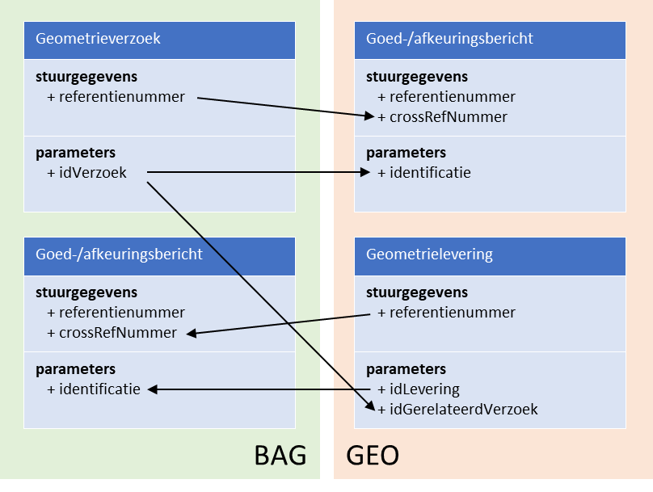

Uitgangspunten
==============

Dit hoofdstuk beschrijft de uitgangspunten voor uitwisseling van gegevens tussen
BAG en Geo via StUF-Geo BAG berichtenverkeer.

Actoren en verantwoordelijkheden: Geo en BAG
============================================

Het StUF-Geo BAG berichtenverkeer kent twee actoren[\^4}: (het
registratiesysteem[\^5] van) BAG en (het registratiesysteem van) Geo, hierna
respectievelijk BAG en Geo.

BAG is eindverantwoordelijk voor de volledigheid van de BAG-objecten, het op een
correcte manier afbakenen van BAG-objecten en de vastlegging en distributie van
de juiste BAG-gegevens volgens de hiervoor geldende wettelijke eisen.

Geo is veelal faciliterend voor de geometrische inwinning en vastlegging van de
geometrie van BAG-objecten conform de eisen van de BAG. Voorts is Geo
verantwoordelijk voor de afstemming van de BGT met de BAG.

De beheerder van Geo[\^6] kan vanuit BAG gemandateerd zijn voor de vaststelling
van de definitieve geometrie van BAG-panden en BAG-verblijfsobjecten. Het
brondocument voor de geometrische mutaties voor BAG-objecten kan en mag
opgemaakt en ondertekend worden door de beheerder van Geo.

[\^4] In het geval dat BAG zelf de inwinning en vastlegging van de geometrie
verzorgt, is een deel van het in dit koppelvlak beschreven berichtenverkeer niet
van toepassing. Geo heeft dan voldoende aan de kennisgevingsberichten vanuit BAG
voor de bijhouding van de gegevens van BGT objecten. [\^5] Registratiesysteem
wordt hierna “applicatie” genoemd. [\^6] In praktijk zijn dit de medewerkers van
Geo, danwel de ambtenaar die belast is me de uitbesteding van inwinning van de
geometrie voor Geo.

Berichten
---------

Het berichtenverkeer tussen Geo en BAG maakt gebruik van de volgende typen
berichten:

-   StUF-Geo BAG berichten: specifiek voor dit koppelvlak gedefinieerde
    dienstberichten t.w.

-   geometrieVerzoek (gmvDi01): een asynchroon inkomend vrij bericht als verzoek
    tot levering van geometrie[\^7] voor een bepaald object.

-   geometrieLevering (gmlDi01): een asynchroon inkomend vrij bericht met de te
    leveren geometrie[\^7] voor een bepaald object.

-   goedkeuringsbericht (bevestigingDu01): een asynchroon responsbericht met de
    goedkeuring van (een deel van de inhoud van) een geometrieVerzoek of
    geometrieLevering.

-   afkeuringsbericht (foutDu01): een asynchroon responsbericht met een
    afkeuring van (een deel van de inhoud van) een geometrieVerzoek of
    geometrieLevering.

-   StUF-BG / BAG-kennisgevingsberichten

-   Logistieke StUF bevestigings- en foutberichten, o.a.

-   Bv03[\^8]: een bevestigingsbericht als technische synchrone respons op een
    asynchroon bericht waarbij het bericht op basis van berichtstuurgegevens
    verwerkbaar wordt geacht[\^9]

-   Fo03: een foutbericht als technische synchrone respons op een asynchroon
    bericht waarbij het bericht niet verwerkbaar wordt geacht.

[\^7] Naast geometrie worden ook enkele administratieve gegevens uitgewisseld;
zie H4 Berichten.

[\^8] Of Bv04: een servicebus stuurt een Bv04 als technisch synchrone respons op
een asynchroon bericht

[\^9] Een technische synchrone respons wordt op elk samengesteld of
kennisgevingsbericht teruggeven cf. StUF conventies, en is dan ook verder niet
opgenomen in de uitwerking van het berichtenverkeer.

De StUF-Geo BAG berichten zijn gespecifieerd in §4.1.

Uitwisselen van gegevens van BAG-objecten
-----------------------------------------

In het StUF-Geo BAG berichtenverkeer worden gegevens uitgewisseld van
BAG-objecten.

### Objecttypen

De volgende BAG-objecttypen worden ondersteund in het Geo-BAG berichtenverkeer:
\* Pand \* Verblijfsobject \* Stand-/ligplaats \* Woonplaats \*
Nummeraanduiding[\^10] \* OpenbareRuimte[\^11]

Dit berichtschema’s van van het Geo-BAG koppelvlak zijn daarnaast uitgebreid met
de optionele objecttypen OverigGebouwdObject en OverigTerrein voor aansluiting
met RSGB. Overig optionele BAG+-objecttypen worden in het Geo-BAG
berichtenverkeer niet ondersteund. In de StUF-Geo BAG berichten worden alleen de
gegevens opgenomen die noodzakelijk zijn voor een goede verwerking van dit
bericht door de ontvanger (zie gegevensmodel in Bijlage 3.).

[\^10] Alleen in BAG-kennisgeving, niet in geometrieVerzoek of
geometrieLevering.

[\^11] Alleen in BAG-kennisgeving, niet in geometrieVerzoek of
geometrieLevering.

### Geometrie

Voor dit koppelvlak geldt dat de geometrie conform de inwinningsregels ten
aanzien van nauwkeurigheid en inwinningswijze van de BAG wordt opgenomen. Een
BAG-object kan een vlak- of puntgeometrie hebben.

De verplichte geometrie voor een Pand in de BAG is een vlakgeometrie in
bovenaanzicht. In het kader van de BGT is Geo ook verantwoordelijk voor de
geometrische inwinning van grootschalige topografie. Voor de BGT is de keuze
gemaakt om van een pand de geometrie op maaiveldniveau op te nemen. Door
modernere bouwvormen komt het daarbij steeds vaker voor dat de geometrie van een
pand op maaiveldniveau aanzienlijk kan afwijken van de geometrie van een pand op
een ander niveau. De geometrie op maaiveld van een Pand kan in de StUF-BG
kennisgevingsberichten als optionele geometrie bij dit object worden opgenomen
naast de verplichte geometrie van bovenaanzicht.

-   In dit koppelvlak wordt in de StUF-Geo BAG dienstberichten[\^12] de
    geometrie van objecten als volgt opgenomen: objecttype Verblijfsobject wordt
    uitgewisseld met puntgeometrie, en optioneel met vlakgeometrie.

-   objecttype Pand wordt uitgewisseld met geometrie van het bovenaanzicht, en
    optioneel met geometrie op het maaiveld.

-   alle overige objecttypen[\^13] in §2.3.1. met vlakgeometrie.

[\^12] Dus niet van toepassing voor de StUF-BG kennisgevingsberichten.

[\^13] M.u.v. Nummeraanduiding en OpenbareRuimte, deze objecttypen hebben geen
geometrie.

### Samengesteld uitwisselen en alleen actuele stand

In de StUF-Geo BAG berichten worden de gegevens van objecten samengesteld
uitgewisseld, d.w.z. een geometrieVerzoek of geometrieLevering bevat de gegevens
van één of meerdere BAG-objecten welke tot één bepaalde transactie of
gebeurtenis behoren. Bijvoorbeeld, indien een door Geo uitgevoerde
mutatiesignalering uit luchtfoto’s mutaties oplevert op meerdere objecten,
worden een of meer mutaties van deze objecten in een bericht (geometrieLevering)
door Geo aan BAG verstuurd.

In dit Geo-BAG berichtenverkeer wordt in een StUF-Geo BAG dienstbericht[\^14]
alleen de actuele stand (WORDT) van een BAG-object uitgewisseld, en niet in
combinatie met de vorige stand (WAS) van het BAG-object[\^15]. Zowel BAG als Geo
hebben de gegevens van een vorige stand van een object niet nodig voor het
overnemen van de gegevens uit een bericht. In het bijzonder geval dat op enig
moment de gegevens van een bepaald object bij Geo en BAG verschillen
(asynchroniteit), zijn de gegevens van de actuele stand in de applicatie van BAG
leidend voor dit object.

[\^14] Dus niet van toepassing voor de StUF-BG kennisgevingsberichten.

[\^15] Dit in afwijking van het StUF-BG en StUF-Geo IMGeo berichtenverkeer waar
in een bericht WAS én WORDT van een object wordt uitgewisseld.

Gebeurtenissen als aanleiding voor berichtenverkeer
---------------------------------------------------

Het berichtenverkeer tussen BAG en Geo ontstaat naar aanleiding van een bepaalde
gebeurtenis aan de kant van BAG of Geo. In Bijlage 1 is een overzicht met alle
gebeurtenissen[\^16] van Geo en BAG opgenomen en tot welke berichten zij leiden.

Naar aanleiding van een BAG-gebeurtenis (bijv. verlenen vergunning) stuurt BAG
aan Geo een verzoek om geometrie aan te leveren, ofwel een geometrieVerzoek.

Naar aanleiding van een Geo-gebeurtenis (bijv. constatering[\^17] nieuw pand
door mutatiesignalering uit luchtfoto’s) of de geometrische inwinning voor BAG
na een geometrieVerzoek, stuurt Geo aan BAG een levering van nieuwe of
gewijzigde geometrie, ofwel een geometrieLevering[\^18]

Naar aanleiding van een levering van nieuwe of gewijzigde geometrie door Geo,
stuurt BAG altijd een functionele respons om de acceptatie en verwerking, of
afkeuring van de levering aan Geo te melden, ofwel een responsbericht.

Naar aanleiding van een doorgevoerde mutatie op een BAG-object , stuurt BAG een
kennisgeving van deze wijziging aan Geo, ofwel een BAG-kennisgevingsbericht (=
StUF-BG). Geo filtert hieruit de voor de Geo/BGT relevante mutaties (bijv.
wijziging van een nummeraanduiding door BAG) en verwerkt deze in de eigen
applicatie.

[\^16] Dit overzicht is gebaseerd op de lijst met gebeurtenissen van het formele
BAG-processenhandboek en aangevuld met de Geo-gebeurtenissen.

[\^17] Dit is een vorm van terugmelding op de registratie van BAG.

[\^18] Geo krijgt de BAG-identificatie van een geconstateerd nieuw pand retour
na overname van BAG via een BAG-kennisgevingsbericht.

Identificaties van en relaties tussen berichten
-----------------------------------------------

### Logistieke en functionele identificatie

In het Geo-BAG berichtenverkeer wordt onderscheid gemaakt tussen logistieke
identificaties en functionele (of logische) identificaties in berichten.

**Logistieke identificatie** is de unieke identificatie van een bericht. De
logistieke identificatie wordt opgenomen in het element ‘referentienummer’ in de
‘stuurgegevens’ van vrije berichten, en in het element ‘crossRefNummer’ van
responsberichten.

Een **functionele identificatie** is een identificerend kenmerk dat hoort bij
meerdere berichten behorende bij één mutatie/transactie bundelt. De functionele
identificatie wordt opgenomen het element ‘idLevering’, ‘idVerzoek’ of
‘identificatie’ van de ‘parameters’.

De functionele identificatie wordt gebruikt om berichten die bij een zelfde
gebeurtenis (vergunning of signalering) horen te bundelen. Bijvoorbeeld, bij het
verlenen van een bouwvergunning door BAG zijn er meerdere berichten voor het
opvoeren van een pand en verblijfsobject. Of na mutatiesignalering door Geo
worden meerdere berichten met constateringen van panden verstuurd. Deze
berichten hebben een eigen unieke logistieke identificatie, maar worden
gebundeld door eenzelfde functionele identificatie.

### Invullen van logistieke en functionele identificaties

Voor het invullen van identificaties in de Geo-BAG berichten gelden de volgende
uitgangspunten.

**Logistieke identificatie:**

-   Een afkeuringsbericht of goedkeuringsbericht (=responsbericht Du01) heeft in
    het crossRefNummer de logistieke identificatie van het geometrieverzoek of
    de geometrielevering.

**Functioneel:**

-   De identificatie van een geometrieverzoek wordt in de geometrielevering
    opgenomen in het element ‘idGerelateerdVerzoek’, als de levering is
    aangemaakt naar aanleiding van een verzoek door BAG.

-   Het element ‘idGerelateerdVerzoek’ blijft leeg als de geometrielevering
    wordt geïnitieerd door Geo, bijvoorbeeld naar aanleiding van een
    constatering/signalering uit een luchtfoto.

Onderstaande figuur geeft weer hoe de identificaties in Geo-BAG berichten worden
doorgegeven.

*Voorbeeld logistieke en functionele identificatie in Geo-BAG berichten.*

|                      | geometrieVerzoek | Goed-/afkeuring GEO |   | geometrieLevering | Goed-/afkeuring BAG |
|----------------------|------------------|---------------------|---|-------------------|---------------------|
| referentienummer     | 000501           | 000750              |   | 000751            | 000502              |
| crossRefnummer       | n.v.t.           | 000501              |   | n.v.t.            | 000751              |
| identificatie[\^19]  | 987654           | 987654              |   | 123456            | 123456              |
| idGerelateerdVerzoek | n.v.t.           | n.v.t.              |   | 987654            | n.v.t.              |

[\^19] identificatie is bij geometrieverzoek het element ‘idVerzoek’, bij een
geometrielevering het element ‘idLevering’ en bij goed/afkeuringsberichten het
element ‘identificatie’ in de parameters.

### Intrekken en corrigeren van berichten

In het StUF-Geo BAG berichtenverkeer kan het voorkomen dat BAG of Geo een eerder
verstuurd StUF-Geo BAG bericht wil corrigeren of intrekken. Een bericht kan door
zender worden gecorrigeerd of ingetrokken indien deze nog niet door ontvanger is
afgehandeld, d.w.z.

-   Als BAG nog geen goed- of afkeuringsbericht op het geometrieverzoek van Geo
    heeft ontvangen.

-   Als Geo nog geen goed- of afkeuringsbericht op de geometrielevering van BAG
    heeft ontvangen.

Voor het **intrekken** van een StUF-Geo BAG bericht wordt een nieuw bericht
gestuurd met daarin opgenomen een eigen unieke logistieke identificatie en een
functionele identificatie gelijk aan de functionele identificatie van het
in-te-trekken bericht.

Voor het **corrigeren** van een StUF-Geo BAG bericht wordt eerst het vorige
bericht ingetrokken en vervolgens een nieuw bericht met een nieuwe functionele
identificatie verstuurd.

*Voorbeeld intrekken en corrigeren geometrielevering[\^20]*

|                      | Nieuwe geometrielevering door Geo | Intrekken geometrielevering door Geo | Corrigeren geometrielevering door Geo |
|----------------------|-----------------------------------|--------------------------------------|---------------------------------------|
| referentienummer     | 000751                            | 000752                               | 000751                                |
| crossRefnummer       | n.v.t.                            | n.v.t.                               | n.v.t.                                |
| identificatie[\^19]  | 123456                            | 123456                               | 12345**7**                            |
| idGerelateerdVerzoek | 987654                            | 987654                               | 987654                                |

In onderstaand voorbeeld wordt de eerste geometrielevering door BAG goedgekeurd
en wordt de intrekking van de geometrielevering door BAG afgekeurd. BAG heeft
daarmee de gegevens uit de geometrielevering geaccepteerd en zal deze gegevens
verder gaan verwerken.

*Voorbeeld goedkeuring op geometrielevering, afkeuring op intrekken
geometrielevering door BAG[\^20]*

|                      | Nieuwe geometrielevering door Geo | Intrekken geometrielevering door Geo | Goedkeuring geometrielevering door BAG | Afkeuring intrekken geometrielefvering door BAG |
|----------------------|-----------------------------------|--------------------------------------|----------------------------------------|-------------------------------------------------|
| referentienummer     | 000**751**                        | 000**752**                           | 000502                                 | 000502                                          |
| crossRefnummer       | n.v.t.                            | n.v.t.                               | 000**751**                             | 000**752**                                      |
| identificatie[\^19]  | 123456                            | 123456                               | 123456                                 | 123456                                          |
| idGerelateerdVerzoek | 987654                            | 987654                               | n.v.t.                                 | n.v.t.                                          |

In onderstaand voorbeeld wordt de eerste geometrielevering door BAG afgekeurd en
wordt de intrekking van de geometrielevering door BAG goedgekeurd. BAG heeft
daarmee de gegevens uit de geometrielevering niet geaccepteerd en zal dus geen
gegevens van Geo gaan verwerken.

*Voorbeeld afkeuring op geometrielevering, goedkeuring op intrekken
geometrielevering door BAG[\^20]*

|                      | Nieuwe geometrielevering door Geo | Intrekken geometrielevering door Geo | Afkeuring geometrielevering door BAG | Goedkeuring intrekken geometrielefvering door BAG |
|----------------------|-----------------------------------|--------------------------------------|--------------------------------------|---------------------------------------------------|
| referentienummer     | 000**751**                        | 000**752**                           | 000502                               | 000502                                            |
| crossRefnummer       | n.v.t.                            | n.v.t.                               | 000**751**                           | 000**752**                                        |
| identificatie[\^19]  | 123456                            | 123456                               | 123456                               | 123456                                            |
| idGerelateerdVerzoek | 987654                            | 987654                               | n.v.t.                               | n.v.t.                                            |

[\^20] Op vergelijkbare wijze worden de identificaties ingevuld voor intrekken
en corrigeren van geometrieverzoeken door BAG, en het goedkeuren/afkeuren
hiervan door Geo.

Identificaties van en relaties tussen objecten
----------------------------------------------

### BAG-objectnummer en versie

Elk object in de BAG heeft een unieke aanduiding bestaande uit een
**identificatie** (ookwel: objectnummer) en **versie**. Met deze unieke
aanduiding is (deze versie van) het object ook bekend in de Landelijke
Voorziening BAG zodra het authentiek is verklaard.

### Technische sleutels

In het Geo-BAG berichtenverkeer worden ook in bepaalde gevallen de technische
(system of database)sleutels van Geo en BAG uitgewisseld. De technische sleutels
van de zender en ontvanger worden uitgewisseld in de attributen
**sleutelVerzendend** en **sleutelOntvangend**.

### Invullen van BAG-objectnummer en technische sleutels

Het opnemen van het BAG-objectnummer (en versie) bij een object is verplicht,
tenzij voor het object nog geen BAG-objectnummer is uitgedeeld. Dit treedt op in
de volgende twee situaties:

-   Bij het versturen van een geometrieVerzoek na gebeurtenis ‘BGR-OBA Ontvangst
    bouwaanvraag’, waarbij het object nog niet is opgenomen in de applicatie van
    BAG.

-   Bij het versturen van een geometrieLevering na gebeurtenis ‘GEO-COG
    Constatering nieuw object’ (bijvoorbeeld bij vergunningsvrije bouw) waarbij
    het object ontstaat in de applicatie van Geo. Geo deelt namelijk geen
    BAG-identificaties uit.

Voor het invullen van BAG-objectnummer en technische sleutels in Geo-BAG
berichten gelden de volgende uitgangspunten:

-   Als het **BAG-objectnummer bij BAG bekend** is, stuurt BAG deze mee én de
    technische systeemsleutel van BAG.

-   Als **het BAG-objectnummer bij Geo bekend** is, dan stuurt Geo de BAG
    identificatie én de technische systeemsleutel van Geo mee.

*Voorbeeld BAG-objectnummer bij BAG of Geo bekend.*

|                   | Geometrieverzoek door BAG        | Geometrielevering door Geo       |
|-------------------|----------------------------------|----------------------------------|
| identificatie     | 0363200000509364                 | 0363200000509364                 |
| versie            | 1                                | 1                                |
| sleutelVerzendend | 29418fff6eea4e798134c142875e85d0 | 898313020f0042b798c0a761087ab2fb |
| sleutelOntvangend | \-                               | \-                               |

-   Als het **BAG-objectnummer bij BAG niet bekend** is, stuurt BAG alleen de
    technische systeemsleutel van BAG.

-   Als het **BAG-objectnummer bij Geo niet bekend en het object is opgenomen in
    een geometrielevering op een geometrieverzoek van BAG**, stuurt Geo de
    technische sleutel van BAG en Geo mee.

*Voorbeeld geometrieverzoek zonder BAG-objectnummer en geometrielevering door
Geo met technische sleutels.*

|                   | Geometrieverzoek door BAG        | Geometrielevering door Geo       |
|-------------------|----------------------------------|----------------------------------|
| identificatie     | \-                               | \-                               |
| versie            | \-                               | \-                               |
| sleutelVerzendend | 29418fff6eea4e798134c142875e85d0 | 898313020f0042b798c0a761087ab2fb |
| sleutelOntvangend | \-                               | 29418fff6eea4e798134c142875e85d0 |

-   Als het **BAG-objectnummer bij Geo niet bekend en het object is opgenomen in
    een goedkeuring of afkeuring op een geometrieverzoek van BAG**, stuurt Geo
    alleen de technische sleutel van BAG mee.

*Voorbeeld BAG-objectnummer bij BAG niet bekend, en goed-/afkeuring door Geo*

|                   | Geometrieverzoek door BAG        | Goed-/afkeuring door Geo         |
|-------------------|----------------------------------|----------------------------------|
| identificatie     | \-                               | \-                               |
| versie            | \-                               | \-                               |
| sleutelVerzendend | 29418fff6eea4e798134c142875e85d0 | \-                               |
| sleutelOntvangend | \-                               | 29418fff6eea4e798134c142875e85d0 |

-   Als het **BAG-objectnummer bij BAG niet bekend en het object is opgenomen in
    een afkeuring op een geometrielevering van Geo**, stuurt BAG alleen de
    technische sleutel van Geo mee.

*Voorbeeld BAG-objectnummer niet bekend, en afkeuring van geometrielevering door
BAG*

|                   | Geometrielevering door Geo       | Afkeuring door BAG               |
|-------------------|----------------------------------|----------------------------------|
| identificatie     | \-                               | \-                               |
| versie            | \-                               | \-                               |
| sleutelVerzendend | 898313020f0042b798c0a761087ab2fb | \-                               |
| sleutelOntvangend | \-                               | 898313020f0042b798c0a761087ab2fb |

-   Als het **BAG-objectnummer bij BAG niet bekend en het object is opgenomen in
    een goedkeuring op een geometrielevering van Geo**, stuurt BAG het nieuwe
    BAG-objectnummer en de technische sleutel van Geo mee.

*Voorbeeld BAG-objectnummer niet bekend, en goedkeuring van geometrielevering
door BAG*

|                   | Geometrielevering door Geo       | Goedkeuring door BAG             |
|-------------------|----------------------------------|----------------------------------|
| identificatie     | \-                               | 0363200000509364                 |
| versie            | \-                               | 1                                |
| sleutelVerzendend | 898313020f0042b798c0a761087ab2fb | \-                               |
| sleutelOntvangend | \-                               | 898313020f0042b798c0a761087ab2fb |

Verzenden en verwerken van berichten
------------------------------------

In StUF-Geo BAG berichtenverkeer kunnen berichten in willekeurige volgorde
worden verzonden en verwerkt.

### Transacties en bundeling van berichten

Bij bepaalde gebeurtenissen (bijv. bij het verlenen van een bouwvergunning voor
een pand met meerdere verblijfsobjecten en nummeraanduidingen) komt het voor dat
gegevens van meerdere objecten uitgewisseld gaan worden. Per transactie[\^23]
wordt een StUF-Geo BAG bericht met een eigen logistieke identificatie en een
gemeenschappelijke functionele identificatie (betreffende de gebeurtenis
‘bouwvergunning verleend’) voor deze transactie samengesteld en in willekeurige
volgorde verstuurd. Het is niet de bedoeling om bijvoorbeeld in één
geometrieverzoek voor alle objecten die op die dag zijn opgevoerd in het hele
gebied van een gemeente de geometrie te vragen. De eenheid van werk dient zo
klein mogelijk gehouden te worden aan de ontvangende kant, om snelle afhandeling
van een verzoek of levering mogelijk te maken.

[\^23] Een transactie is een samenstelling / bundeling van (gewijzigde) gegevens
van één of meer objecten wat tot een bepaalde gebeurtenis of eenheid van werk
toebehoord.

### Verplichte of niet-verplichte overname

De gegevens van een object in het StUF-Geo BAG berichtenverkeer welke worden
uitgewisseld met asynchrone kennisgevingsberichten kunnen verplicht zijn om te
verwerken in de ontvangende applicatie of informatief bedoeld zijn. Of een
BAG-kennisgeving in een bericht verplicht of informatief is, wordt opgenomen in
de parameter met resp. “V” (Verplicht) of “I” (Informatief).

Voor het Geo-BAG berichtenverkeer heeft een BAG-kennisgeving een
indicatorOvername “V” (Verplicht), omdat BAG eindverantwoordelijk is voor de
(kwaliteit van) gegevens van de BAG-objecten. Geo neemt de gegevens van BAG
verplicht over in de eigen registratie.

In een StUF-Geo BAG bericht komt het element indicatorOvername niet voor, omdat
geen gebruik wordt gemaakt van kennisgevingen24 maar van elementen met een
StUF:functie:”entiteit” (hierna: entiteit. De objectgegevens in een
geometrieLevering of geometrieVerzoek zijn niet verplicht om over te nemen, en
dienen enkel ter identificatie van het object waarvoor geometrie wordt gevraagd
of geleverd.

[\^24] Dit omdat alleen de actuele stand van een object wordt uitgewisseld en
geen WAS/WORDT structuur.

### Volgorde van verzenden en verwerken

Het verzenden van een bericht wordt geïnitieerd door zender en is
eenrichtingsverkeer (push-mechanisme). De zendende applicatie kan meerdere
berichten achter elkaar versturen, waarbij een volgend bericht niet per sé
verzonden wordt na bevestiging van ontvangst van het vorige bericht.

De ontvanger bevestigt te allen tijde de ontvangst van een bericht met een
technisch synchrone respons t.b.v. de logistiek (Bv03/Bv04 of Fo03). Als op een
bericht binnen een bepaalde termijn geen bevestiging van ontvangst is
teruggekomen, mag de zender veronderstellen dat het bericht niet is aangekomen.
Omdat het de verantwoordelijkheid van zender is dat berichten ‘aankomen’, dient
de zender opnieuw het bericht te versturen aan ontvanger.

De afhandeling van het bericht door ontvanger is asynchroon, d.w.z. dat het
ontvangen bericht op later moment (dus niet gelijk = synchroon) verwerkt wordt.
De berichten in de wachtrij van de ontvangende applicatie worden conform StUF
verwerkt, ofwel: op volgorde van tijdstipBericht.

### Synchroniteit

Op bepaalde momenten kunnen de gegevens van BAG-objecten in de applicaties van
BAG en Geo tijdelijk uit elkaar lopen (bijv. na afwijzing van een nieuw
geconstateerd Pand in een levering van Geo welke na beoordeling door BAG een
niet-relevant BAG-object blijkt te zijn, dus geen BAG-Pand). Geo is
verantwoordelijk voor de synchronisatie van de eigen applicatie met BAG voor
o.a. overname van gegevens bij het BGT-object Pand.
