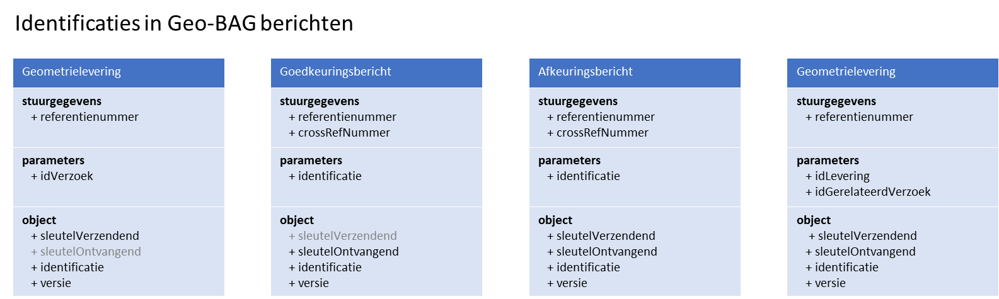
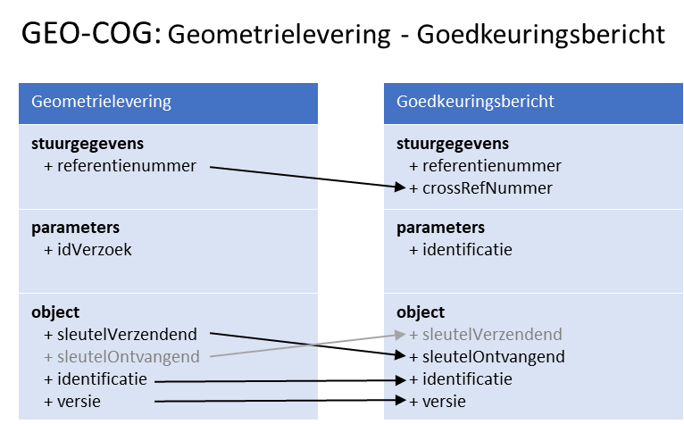

Bijlage Toelichting identificaties in Geo-BAG berichten
=======================================================

In het Geo-BAG berichtenverkeer wordt onderscheid gemaakt tussen logistieke
identificaties en functionele (of logische) identificaties in berichten.

**Logistieke identificatie** is de unieke identificatie van een bericht. De
logistieke identificatie wordt opgenomen in het element ‘referentienummer’ in de
‘stuurgegevens’ van vrije berichten, en in het element ‘crossRefNummer’ van
responsberichten.

Een **functionele identificatie** is een identificerend kenmerk dat hoort bij
meerdere berichten behorende bij één mutatie/transactie bundelt. De functionele
identificatie wordt opgenomen het element ‘idLevering’, ‘idVerzoek’ of
‘identificatie’ van de ‘parameters’.

De functionele identificatie wordt gebruikt om berichten die bij een zelfde
gebeurtenis (vergunning of signalering) horen te bundelen. Bijvoorbeeld, bij het
verlenen van een bouwvergunning door BAG zijn er meerdere berichten voor het
opvoeren van een pand en verblijfsobject. Of na mutatiesignalering door Geo
worden meerdere berichten met constateringen van panden verstuurd. Deze
berichten hebben een eigen unieke logistieke identificatie, maar worden
gebundeld door eenzelfde functionele identificatie.

Daarnaast heeft ieder BAG(+)-**object** een eigen unieke aanduiding in het
element **identificatie** (objectnummer) en **versie**. De technische (system of
database)sleutels van de zender en ontvanger worden uitgewisseld in de
attributen **sleutelVerzendend** en **sleutelOntvangend**.

Invullen van identificaties
---------------------------

Voor het invullen van identificaties in de Geo-BAG berichten gelden de volgende
uitgangspunten.

**Logistiek:**

-   Een afkeuringsbericht of goedkeuringsbericht (=responsbericht Du01) heeft in
    het crossRefNummer de logistieke identificatie van het geometrieverzoek of
    de geometrielevering.

**Functioneel:**

-   De identificatie van een geometrieverzoek wordt in de geometrielevering
    opgenomen in het element ‘idGerelateerdVerzoek’, als de levering is
    aangemaakt naar aanleiding van een verzoek door BAG.

-   Het element ‘idGerelateerdVerzoek’ blijft lee gals de geometrielevering
    wordt geïnitieerd door Geo, bijvoorbeeld naar aanleiding van een
    constatering/signalering uit een luchtfoto.

Object:

-   Als er geen BAG-identificatie bekend is van het object, wordt altijd de
    sleutelVerzendend meegestuurd bij het object.

-   Als er wel een BAG-identificatie bekend is van het object

De identificaties worden

De gerelateerde identificatie kan worden opgenomen in

Bijzondere scenario’s
=====================

Intrekken van een levering
--------------------------

Eerst wordt een levering gestuurd als reactie op een geometrieverzoek. De
geometrielevering heeft de volgende identificaties:

| **Identificaties** | **XML-element**         | **Waarde** |
|--------------------|-------------------------|------------|
| Logistiek          | StUF:referentienummer   | 186        |
| Functioneel        | BG:idLevering           | 186        |
|                    | BG:idGerelateerdVerzoek | verzoek123 |

Vervolgens wordt deze levering ingetrokken, voor dat een goed- of afkeuring op
de eerdere levering is ontvangen. Hiervoor wordt een geometrielevering met
gebeurtenis ‘Geo-NEG’ verzonden met de volgende identificaties:

| **Identificaties** | **XML-element**       | **Waarde** |
|--------------------|-----------------------|------------|
| Logistiek          | StUF:referentienummer | 187        |
| Functioneel        | BG:idLevering         | 186        |

### Situatie A. Goedkeuring op levering, afkeuring op intrekking.

BAG keurt de levering goed, en keurt de intrekking van de geometrielevering af.

| **Identificaties** | **XML-element**       | **Waarde** |
|--------------------|-----------------------|------------|
| Logistiek          | StUF:referentienummer | 187        |
|                    | StUF:crossRefnummer   |            |
| Functioneel        | BG:idLevering         | 186        |
| **Identificaties** | **XML-element**       | **Waarde** |
| Logistiek          | StUF:referentienummer | 187        |
| Functioneel        | BG:idLevering         | 186        |

Goedkeuring op geometrieverzoek

\<StUF:referentienummer\>                         10643

\<StUF:crossRefnummer\>                            186

\<BG:identificatie\>                                        186

### Situatie B. Goedkeuring op intrekking, afkeuring op levering.

Op levering

En daarop is een goedkeuring ontvangen.

\<StUF:referentienummer\>                         10643

\<StUF:crossRefnummer\>                            186

\<BG:identificatie\>                                        186

**Respons op de intrekking (is dan een fout, omdat levering al goedgekeurd) op
intrekking zou moeten hebben:**

**\<StUF:referentienummer\>                         10644**

**\<StUF:crossRefnummer\>                            187**

**\<BG:identificatie\>                                        186**

Het is nu onduidelijk of deze goedkeuring de levering of de intrekking betreft.
Het crossrefnummer lijkt op de levering te duiden (de identificatie is in dit
scenario onbruikbaar?).

Hoe zou dit scenario moeten verlopen?
